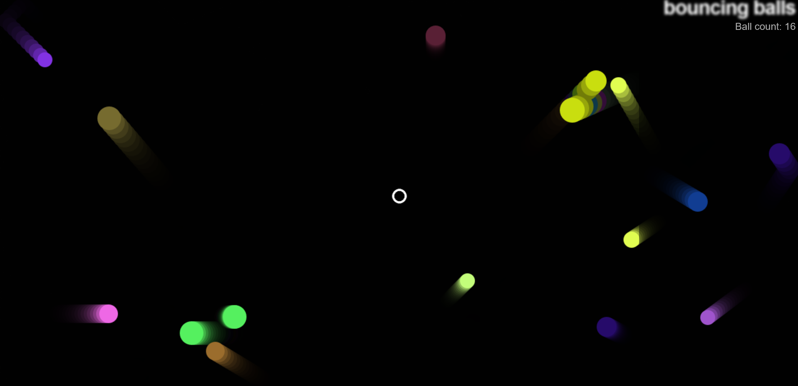

# Bouncing Ball vs. Evil Circle

**Bouncing Ball vs. Evil Circle** is a fun and engaging HTML, CSS, and JavaScript game where a ball bounces around the screen, trying to avoid being swallowed by an evil circle. The goal is to survive as long as possible while controlling the ball to evade the evil circle.

## 🎮 Gameplay

- The player controls a **bouncing ball** that moves across the screen.
- The objective is to **avoid being swallowed** by the evil circle that roams around the screen.
- The game ends when the ball collides with the evil circle.
- The game speed increases gradually, making it more challenging.

## 🖥️ Features

- **Ball Movement**: The ball bounces off the edges of the screen.
- **Evil Circle AI**: The evil circle moves around the screen trying to catch the ball.
- **Mouse/Keyboard Controls**: The player can control the ball using the arrow keys or mouse.
- **Game Over Screen**: When the ball touches the evil circle, the game ends with a "Game Over" message.

## 🚀 Getting Started

### Prerequisites

- A modern web browser (e.g., Chrome, Firefox, Safari, etc.) is required to play the game.

### Installation

1. **Clone the repository**:
    ```bash
    git clone https://github.com/your-username/bouncing-ball-vs-evil-circle.git
    ```

2. **Navigate to the project directory**:
    ```bash
    cd bouncing-ball-vs-evil-circle
    ```

3. **Open the `index.html` file** in your browser to start playing.

### Controls

- **Arrow Keys**: Use the arrow keys to control the ball's movement.
- **Mouse**: Move the mouse to control the ball.

## 🖼️ Screenshots




## 💡 How It Works

The game uses **HTML** for structure, **CSS** for styling, and **JavaScript** for interactivity. The ball and evil circle are rendered using simple DOM elements and styled using CSS. The movement logic is handled by JavaScript, and collision detection ensures the game ends when the ball is swallowed by the evil circle.

## 📢 Contributing

If you'd like to contribute to this project, feel free to fork the repository and submit a pull request. Here's how you can contribute:

1. Fork the repository.
2. Create a new branch (`git checkout -b feature-name`).
3. Make your changes and commit them (`git commit -m 'Add feature'`).
4. Push to your forked repository (`git push origin feature-name`).
5. Create a pull request on GitHub.

## 📝 License

This project is open-source and available under the [MIT License](LICENSE).

## 🤝 Acknowledgements

- Thanks to **MDN Web Docs** for helpful resources on JavaScript, CSS, and HTML.
- Inspiration from classic bouncing ball games.

---

Enjoy the game! 🎮
